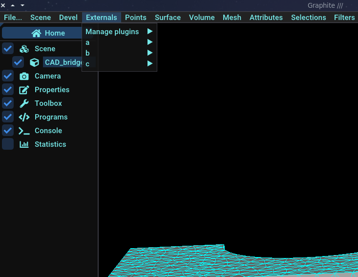
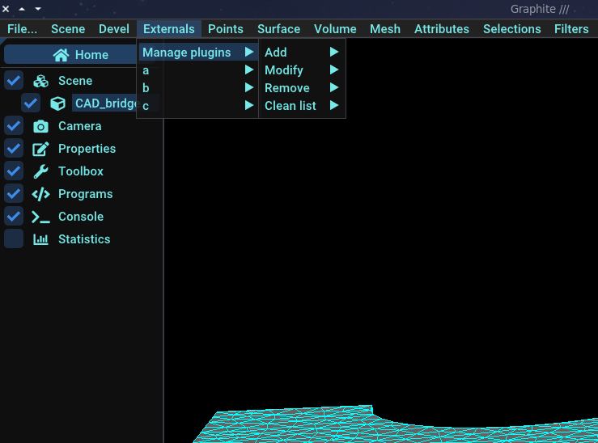
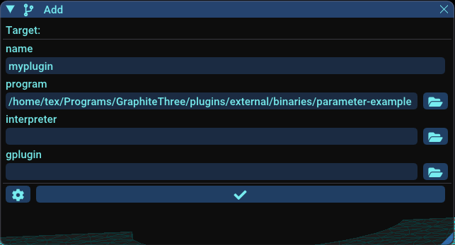

# graphite-ext-plugin-loader

The `ext_loader.lua` script aims to load external programs or scripts as Graphite plugins. 

## Enable Graphite loading external programs

You need to start graphite from the command line, passing the `ext_loader.lua` lua script as argument:

`> graphite ext_loader.lua`

Graphite will start and execute this script. A menu `Externals` should appear.



## Manage external plugins

External plugins can be managed via the menu `Externals -> Manage plugins`.



### Add an external plugin

You can add an external plugin via the menu `Externals -> Manage plugins -> Add`.



 - Name: an arbitrary name for the plugin
 - Program: program to execute
 - Interpreter (OPTIONAL): path or name of interpreter used to execute program (e.g: a python script need `python3` interpreter)
 - gplugin (OPTIONAL): `gplugin` file that contains parameters info of the program

### Modify

You can modify an external plugin via the menu `Externals -> Manage plugins -> Modify -> PLUGIN_NAME` in the same manner as add an external plugin.

### Remove an external plugin

You can remove an external plugin via the menu `Externals -> Manage plugins -> Remove`. Just type the name of the plugin you want to remove from Graphite. Note that it just remove the plugin from the list of plugins that should be loaded by Graphite. It doesn't remove any files.

### Clean up plugin list file

You can clean up the list of external plugins via the menu `Externals -> Manage plugins -> Clean list`. This command just clean up the list of external plugins that Graphite should load. In fact, it remove the file `ext_plugin_list.txt`. This file will be re-created automatically by `ext_loader` as soon as you add a new external plugin.

Note: All external plugins are listed in the file `ext_plugin_list.txt` in the Graphite root folder.

## How Graphite recognize external plugins ?

To enable Graphite to load plugins and generate the appropriate user interface (UI), it is necessary to present program parameters in a specific format that can be read and understood by Graphite. Let's call this format EPF (External Plugin Format / Expose Parameter Format). 

This format is obtained by Graphite when executing `ext_loader.lua` in two different ways: 
 
 - Calling an executable with `--show-params` argument, returning program parameters as __EPF format__
 - Reading a `.gplugin.txt` file at __EPF format__

## EPF format

 EPF format is very simple and looks like this:

```
 #This file contains reflexion information for calling a binary file
name=param1;type=bool;value=false;possible_values=undefined;description=A bool;type_of_param=undefined
name=param2;type=double;value=0;possible_values=undefined;description=A double;type_of_param=undefined
...
```

Each line contains data about one parameter:
 - __name__: parameter name (displayed as a label in UI)
 - __type__: parameter type {int, float, double, bool, string, file, input}
 - __possible_values__: a list of values to be selected if parameter is an enum
 - __description__: a description of the parameter that can be displayed as a tooltip text in UI
 - __type_of_param__: ...
 - __visible__ (optional): indicate whether the parameter is visible in the UI
 - __target_format__ (optional): indicate how to format of parameter argument when calling program
 

Line that start with `#` are comments.


## Make a program recognizable by Graphite

There is two way to turn a program into an external plugin recognizable by `ext_loader`:

 - Executable must respond to the `--show-params` argument, returning program parameters as __EPF format__
 - Or, deliver a `.gplugin.txt` file that contains program parameter as __EPF format__
 
### Embedded in the program

For the programs written in C++, we encourage to use https://github.com/ultimaille/param-parser.

### Using gplugin file

If you already have a program that accept some parameters in a given format, it's possible to indicate how the program should be called using the `target_format` field. For example, we have a program that should be called like this:

`script.py my_model.obj -dist area -init-mode auto -feat`

We can define the following `.gplugin.txt` file that contains info about script parameters and how to format arguments:

```
name=input;type=file;description=Input model;visible=false;target_format=$input_model
name=dist;type=string;value=area;description=Distorsion;visible=true;target_format=-dist $val
name=init-mode;type=string;value=auto;possible_values=auto,zero,smooth,curv,random;description=Framefield init mode;visible=true;target_format=-init-mode $val
name=feat;type=bool;value=true;description=Detect features;visible=true;target_format=-feat
```

Predefined variables:
 - __$val__: argument value
 - __$input_model__: current model in Graphite