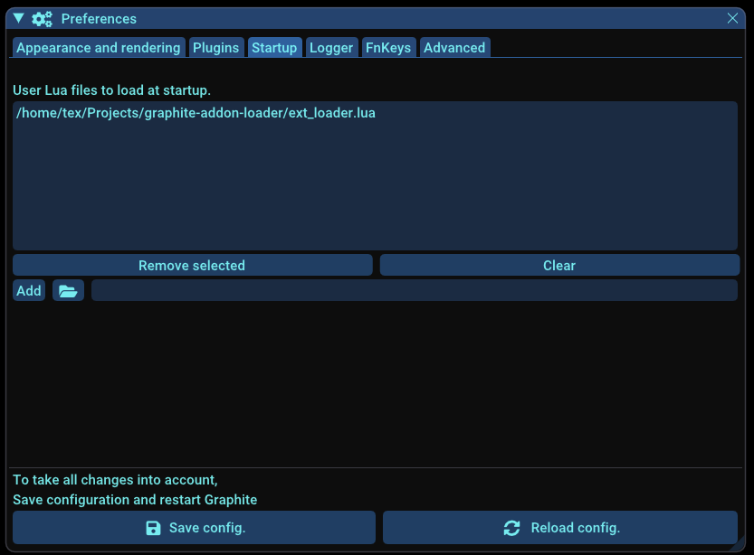
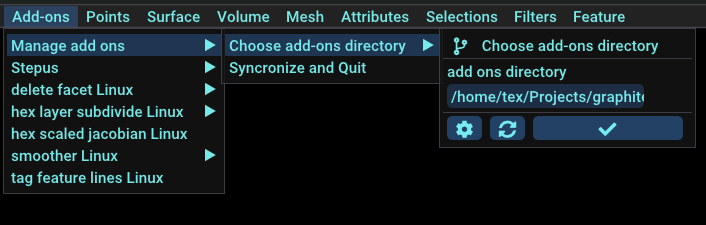
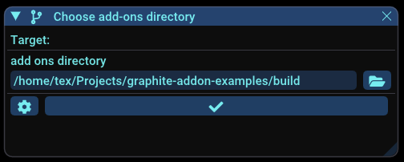

# graphite-addon-loader

The `addon_loader.lua` script aims to load external programs or scripts as [Graphite](https://github.com/BrunoLevy/GraphiteThree) add-ons. 

## Prerequisites

 - Graphite > v3-1.8.8

## Enable Graphite loading add-ons

### Get addon-loader

 - Download the script file `addon_loader.lua`
 - Put this script into a directory of your choice, **preferably in a non-volatile directory with a well-formed path**

### Configure Graphite

You have to go to `File -> Preferences -> Startup` and add the lua script `addon_loader.lua`. **Don't forget to click on `Save Config.` and restart Graphite**.



Graphite will start and execute this script. A menu `Add-ons` should appear.



### Add add-ons

You can add many add-ons at once by choosing an add-ons directory via the menu `Add-ons -> Manage add-ons -> Choose add-ons directory`. The directory will be scanned (browsing all subdirectories) and all executables with extension `.exe` or `.addon` will be recognized as add-ons.



### Synchronize

When you add or remove an add-on or change its interface, you have to synchronize Graphite with these modifications. You can update your add-ons by via the menu `Add-ons -> Manage add-ons -> Synchronize and Quit`. One this command applied Then, you have to restart Graphite manually.

## Try with an existing add-on

As you probably don't have any add-ons at hand, we've put together a series of small add-on examples for you. You can go to:

https://github.com/ultimaille/graphite-addon-examples/releases/tag/v2.0

You will find binary of add-ons that you can add to Graphite. 

_Note: Mac OS binaries are not signed, but we hope that this will be the case in the future._

---

## Create add-ons

To turn a program into an add-on recognizable by `addon_loader`, your program must: 

 - Have `.exe` or `.addon` extension, for example: `my_program.exe`, `my_program.addon`
 - Respond to the `--show-params` argument, returning program parameters as __EPF format__
 - Accept to be called with arguments as the following format: `k1=v2 k2=v2 ... kn=vn` with `ki` the parameter name and `vi` the value of the parameter (e.g: `my_program param_string=hello param_bool=true param_int=1 ...`)
 
 
_Note: for the programs written in __C++__, we encourage you to use https://github.com/ultimaille/param-parser. This micro library help you to declare parameters and return __EPF format__ when `--show-params` is requested._

You will find add-on source C++ examples at https://github.com/ultimaille/graphite-addon-examples.

### How Graphite recognize add-ons ?

To enable Graphite loading add-ons and generate the appropriate user interface (UI), it is necessary to present program parameters in a specific format that can be read and understood by Graphite. Let's call this format __EPF format__ for External add-on Format / Expose Parameter Format.

This format is obtained by Graphite when executing `addon_loader.lua` by calling a program with `--show-params` argument, returning program parameters as __EPF format__.

### EPF format

__EPF format__ is very simple and looks like this:

```
 #This file contains reflexion information for calling a binary file
name=param1;type=bool;value=false;possible_values=undefined;description=A bool;type_of_param=undefined
name=param2;type=double;value=0;possible_values=undefined;description=A double;type_of_param=undefined
...
```

Each line contains data about one parameter:
 - __name__: parameter name (displayed as a label in UI)
 - __type__: parameter type {int, float, double, bool, string, file, input}
 - __possible_values__: a list of values to be selected if parameter is an enum
 - __description__: a description of the parameter that can be displayed as a tooltip text in UI
 - __type_of_param__: {basic, advanced or system} describe how the parameter should be appear in UI
 - __visible__ (optional): indicate whether the parameter is visible in the UI

Line that start with `#` are comments.


