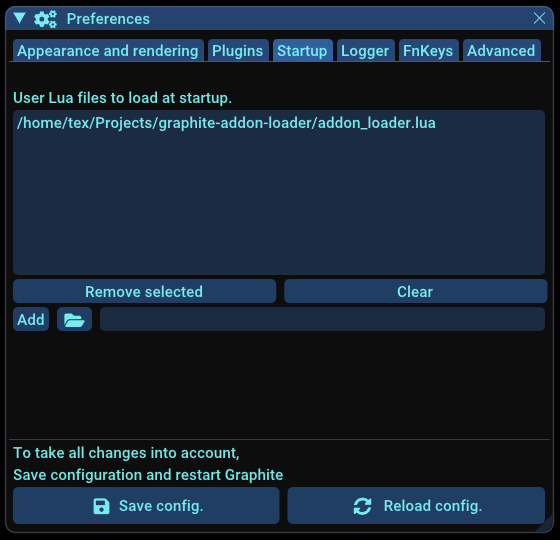

# graphite-addon-loader

The `addon_loader.lua` script aims to load external programs or scripts as [Graphite](https://github.com/BrunoLevy/GraphiteThree) add-ons. 

## Prerequisites

 - Graphite >= v3-1.8.8

## Enable Graphite loading add-ons

### Get addon-loader

 - Download the script file `addon_loader.lua`
 - Put this script into a directory of your choice, **preferably in a non-volatile directory with a well-formed path**

### Configure Graphite

You have to go to `File -> Preferences -> Startup` and add the lua script `addon_loader.lua`. **Don't forget to click on `Save Config.` and restart Graphite**.



Graphite will start and execute this script. A menu `Externals` should appear.


## Manage add-ons

External add-ons can be managed via the menu `Externals -> Manage add-ons`.


### Add an external add-on

You can add an external add-on via the menu `Externals -> Manage add-ons -> Add`.


 - Name: an arbitrary name for the add-on
 - Program: program to execute
 - Interpreter (OPTIONAL): path or name of interpreter used to execute program (e.g: a python script need `python3` interpreter)

### Modify

You can modify an external add-on via the menu `Externals -> Manage add-ons -> Modify -> add-on_NAME` in the same manner as add an external add-on.

### Remove an external add-on

You can remove an external add-on via the menu `Externals -> Manage add-ons -> Remove`. Just type the name of the add-on you want to remove from Graphite. Note that it just remove the add-on from the list of add-ons that should be loaded by Graphite. It doesn't remove any files.

### Clean up add-on list file

You can clean up the list of external add-ons via the menu `Externals -> Manage add-ons -> Clean list`. This command just clean up the list of external add-ons that Graphite should load. In fact, it remove the file `ext_add-on_list.txt`. This file will be re-created automatically by `addon_loader` as soon as you add a new external add-on.

Note: All external add-ons are listed in the file `ext_addon_list.txt` in the Graphite root folder.

## Try with an existing add-on

As you probably don't have any add-ons at hand, we've put together a series of small add-on examples for you. You can go to:

https://github.com/ultimaille/graphite-addon-examples/releases/tag/v1.0 

You will find binary of add-ons that you can add to Graphite. 

_Note: Mac OS binaries are not signed, but we hope that this will be the case in the future._

---

## Create add-ons

### How Graphite recognize external add-ons ?

To enable Graphite loading add-ons and generate the appropriate user interface (UI), it is necessary to present program parameters in a specific format that can be read and understood by Graphite. Let's call this format __EPF format__ for External add-on Format / Expose Parameter Format. 

This format is obtained by Graphite when executing `addon_loader.lua` by calling a program with `--show-params` argument, returning program parameters as __EPF format__.

### EPF format

__EPF format__ is very simple and looks like this:

```
 #This file contains reflexion information for calling a binary file
name=param1;type=bool;value=false;possible_values=undefined;description=A bool;type_of_param=undefined
name=param2;type=double;value=0;possible_values=undefined;description=A double;type_of_param=undefined
...
```

Each line contains data about one parameter:
 - __name__: parameter name (displayed as a label in UI)
 - __type__: parameter type {int, float, double, bool, string, file, input}
 - __possible_values__: a list of values to be selected if parameter is an enum
 - __description__: a description of the parameter that can be displayed as a tooltip text in UI
 - __type_of_param__: ...
 - __visible__ (optional): indicate whether the parameter is visible in the UI
 - __target_format__ (optional): indicate how to format of parameter argument when calling program

Line that start with `#` are comments.


### Make a program recognizable by Graphite

To turn a program into an external add-on recognizable by `addon_loader`, your program must: 

 - Respond to the `--show-params` argument, returning program parameters as __EPF format__
 - Accept to be called with arguments as the following format: `k1=v2 k2=v2 ... kn=vn` with `ki` the parameter name and `vi` the value of the parameter (e.g: `my_program param_string=hello param_bool=true param_int=1 ...`)
 
_Note: for the programs written in __C++__, we encourage you to use https://github.com/ultimaille/param-parser. This micro library help you to declare parameters and return __EPF format__ when `--show-params` is requested._

You will find add-on source C++ examples at https://github.com/ultimaille/graphite-addon-examples.